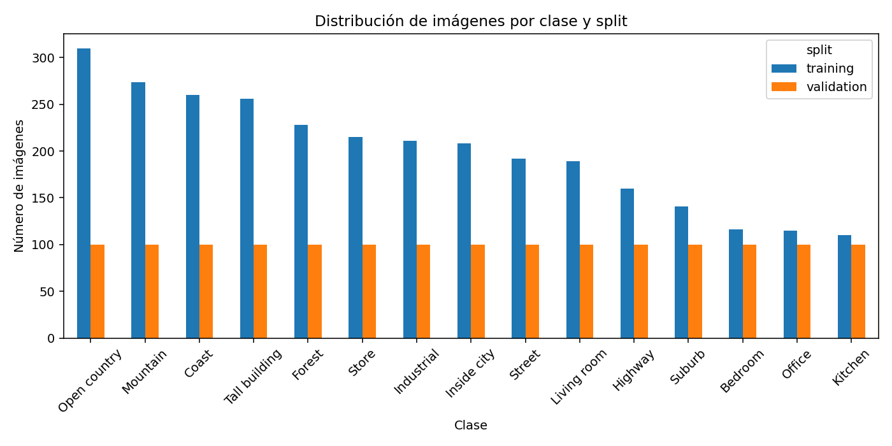
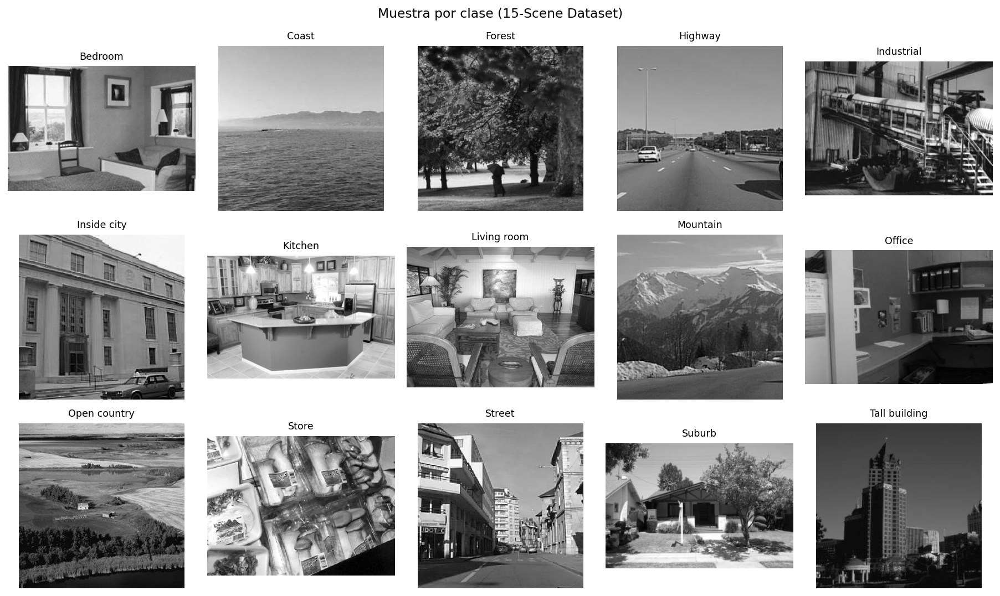

# Exploratory Data Analysis - Real Estate Image Classifier
## 1. Visión general del dataset
- **Splits provistos**: training (2985 imágenes), validation (1500 imágenes)
- **Total de imágenes**: 4485
- **Número de clases**: 15
- **Modo de color**: {'L': 4485}
## 2. Mapeo a categorías de negocio (marketplace inmobiliario)
| Clase original | Familia de negocio | Etiqueta para el cliente |
|---|---|---|
| Bedroom | Interior | Dormitorio |
| Coast | Entorno natural | Costa / Mar |
| Forest | Entorno natural | Bosque |
| Highway | Exterior urbano | Carretera / Vía rápida |
| Industrial | Interior | Nave industrial |
| Inside city | Exterior urbano | Vista urbana interior |
| Kitchen | Interior | Cocina |
| Living room | Interior | Salón |
| Mountain | Entorno natural | Montaña |
| Office | Interior | Despacho / Oficina |
| Open country | Entorno natural | Campo abierto |
| Store | Interior | Local comercial |
| Street | Exterior urbano | Calle |
| Suburb | Exterior urbano | Suburbio / Adosados |
| Tall building | Exterior urbano | Edificio en altura |

## 3. Distribución por clase
| Clase | training | validation | total |
|---|---|---|---|
| Open country | 310 | 100 | 410 |
| Mountain | 274 | 100 | 374 |
| Coast | 260 | 100 | 360 |
| Tall building | 256 | 100 | 356 |
| Forest | 228 | 100 | 328 |
| Store | 215 | 100 | 315 |
| Industrial | 211 | 100 | 311 |
| Inside city | 208 | 100 | 308 |
| Street | 192 | 100 | 292 |
| Living room | 189 | 100 | 289 |
| Highway | 160 | 100 | 260 |
| Suburb | 141 | 100 | 241 |
| Bedroom | 116 | 100 | 216 |
| Office | 115 | 100 | 215 |
| Kitchen | 110 | 100 | 210 |

- Ratio de desbalance en training (max/min): **2.82x** - moderado, las clases minoritarias (Kitchen=110, Office=115, Bedroom=116) frente a las mayoritarias (Open country=310, Mountain=274) requieren estratificación y, opcionalmente, sample weights.
## 4. Resolución de las imágenes
| Estadístico | Width | Height |
|---|---|---|
| mean | 273.1 | 245.0 |
| std | 32.7 | 22.2 |
| min | 203.0 | 200.0 |
| 10% | 256.0 | 220.0 |
| 50% | 256.0 | 256.0 |
| 90% | 330.0 | 256.0 |
| max | 552.0 | 411.0 |

Las imágenes son típicas del 15-Scene benchmark: en torno a 256x256, en su mayoría escala de grises. Para transfer learning con backbones ImageNet conviene **convertir a RGB** y reescalar a 224x224.

## 5. Estrategia de transfer learning recomendada
Tamaño moderado (~3.000 imágenes de training) y dominio razonablemente alineado con ImageNet (escenas naturales y objetos comunes). Recomendaciones:

1. **Backbones preentrenados en ImageNet** son la mejor relación coste/beneficio: MobileNetV3-Small, EfficientNetB0/B3, ResNet50.
2. Pipeline en dos fases: (a) **feature extraction** con backbone congelado durante 3-5 épocas para estabilizar el clasificador; (b) **fine-tuning parcial** de las últimas capas con LR diferencial (LR backbone = LR head / 10).
3. Aumentado fuerte: flips horizontales, rotación ±15°, jitter de color, RandomResizedCrop(0.7-1.0), Cutout/RandomErasing. La mezcla mixup/cutmix solo en el modelo grande dado el coste en CPU.
4. Loss con **label smoothing 0.1** y **stratified split 70/15/15** (reagrupando train+val originales para construir los tres conjuntos).
5. Evaluación: matriz de confusión, F1 por clase y ROC-AUC OvR. Atención especial a parejas confundibles desde una perspectiva de negocio (Living room ↔ Bedroom, Inside city ↔ Tall building, Open country ↔ Mountain).

## 6. Restricciones de hardware detectadas
El entorno actual es **CPU-only** (PyTorch 2.7.0+cpu). Esto:

- Bloquea el Bloque C (ViT/Swin/DeiT) por coste prohibitivo.
- Limita el Bloque B a backbones ligeros (EfficientNetB0/B3) con pocas épocas y batch size reducido.
- Aplicamos `torch.set_num_threads(os.cpu_count())`, `pin_memory=False`, `num_workers` bajo (riesgo de cuelgues en Windows/Python 3.13) y entrenamiento determinista con SEED=42.

## 7. Visualizaciones

